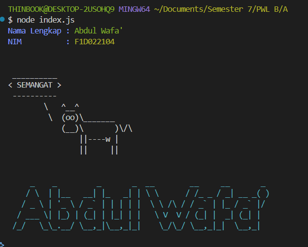
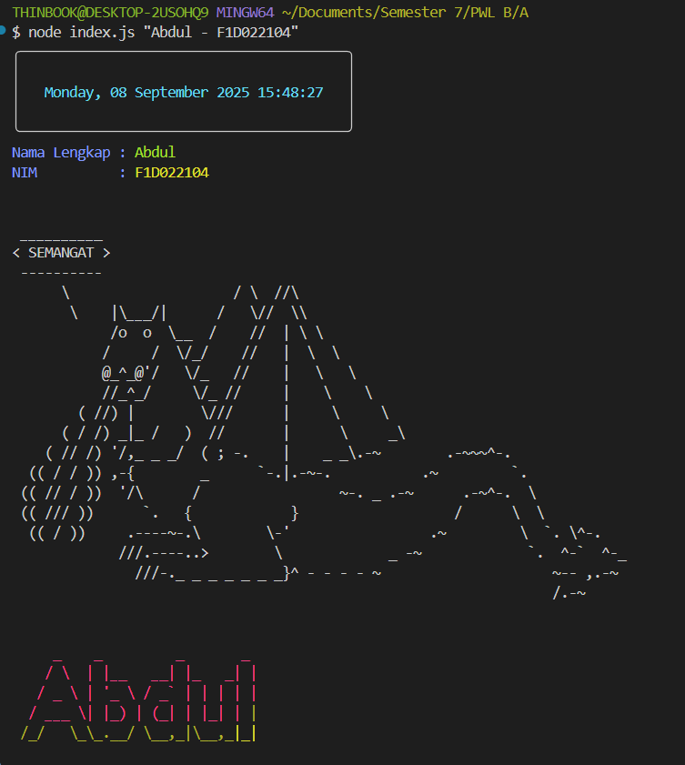

# Cara Install & Menjalankan Project

Project ini menampilkan Nama, NIM, pesan motivasi, tanggal & waktu, dan ASCII art dengan tampilan visual menarik menggunakan Node.js serta package `chalk`, `cowsay`, `figlet`, `gradient-string`, `boxen`, dan `dayjs`.

Terdapat dua versi karakter untuk pesan motivasi:

- **Versi 1:** Menggunakan karakter sapi (default cowsay)
- **Versi 2:** Menggunakan karakter dragon (cowsay dragon)

## Langkah Instalasi

1. **Clone atau download repository ini.**
2. **Buka terminal di folder project.**
3. **Install dependencies:**
   ```bash
   npm install
   ```

## Menjalankan Project

Jalankan perintah berikut di terminal untuk versi sapi:

```bash
node index.js
```

Untuk versi dragon, gunakan file index.js yang sudah dimodifikasi karakter cowsay-nya menjadi dragon:

```bash
node index.js "Nama Kamu - NIMKamu"
```

## Contoh Hasil

- **Versi Sapi:**
  
- **Versi Dragon:**
  

## Catatan

- Pastikan Node.js sudah terinstall di komputer Anda.
- Jika menggunakan ES Modules, pastikan di `package.json` terdapat:
  ```json
  {
  	"type": "module"
  }
  ```

## Dependencies

- [chalk](https://www.npmjs.com/package/chalk)
- [cowsay](https://www.npmjs.com/package/cowsay)
- [figlet](https://www.npmjs.com/package/figlet)
- [gradient-string](https://www.npmjs.com/package/gradient-string)
- [boxen](https://www.npmjs.com/package/boxen)
- [dayjs](https://www.npmjs.com/package/dayjs)

---

Created by Abdul Wafa'
